# Entity Relationship Diagram — Pesantren Digital

Diagram ini mencerminkan `prisma/schema.prisma` setelah penerapan kontrol akses
berbasis peran (multi-role). Perubahan utama terhadap versi sebelumnya: atribut
`User.role` (nilai tunggal) diganti menjadi `User.roles` (himpunan nilai),
sehingga satu pengguna dapat memegang beberapa peran sekaligus.

## Diagram

```mermaid
erDiagram
    User ||--o{ Session : "membuka"
    User |o--o{ StudentProfile : "wali dari"
    User |o--o{ Admission : "mengajukan"
    User |o--o{ Course : "membuat"
    User |o--o{ Course : "mengampu"
    User |o--o{ Announcement : "menulis"
    User |o--o{ ReportCard : "menyusun"
    User ||--o{ StaffAttendance : "kehadirannya"
    User |o--o{ StaffAttendance : "mencatat"
    User ||--o{ BkkhReport : "melaporkan"

    Course ||--o{ ScheduleSlot : "dijadwalkan pada"
    Course ||--o{ Enrollment : "diikuti"
    Course ||--o{ AttendanceSession : "memiliki sesi"
    Course ||--o{ GradeItem : "memiliki komponen"

    StudentProfile ||--o{ Enrollment : "terdaftar di"
    StudentProfile ||--o{ AttendanceRecord : "kehadirannya"
    StudentProfile ||--o{ GradeRecord : "nilainya"
    StudentProfile ||--o{ ReportCard : "menerima"

    AttendanceSession ||--o{ AttendanceRecord : "berisi"
    GradeItem ||--o{ GradeRecord : "berisi"
    ReportCard ||--o{ ReportCardEntry : "berisi"

    User {
        string id PK
        string name
        string email UK
        string phone "nullable"
        string passwordHash
        UserRole_array roles "ADMIN, TEACHER, HOMEROOM, MUDIR, PARENT"
        UserStatus status "PENDING, VERIFIED, REJECTED, SUSPENDED"
        datetime verifiedAt "nullable"
        string verifiedById "nullable"
        datetime createdAt
        datetime updatedAt
    }

    StudentProfile {
        string id PK
        string name
        EducationLevel level "SD, SMP, SMA"
        string studentNumber UK
        string className
        string phone "nullable"
        string address "nullable"
        string parentId FK "nullable, ke User"
        datetime createdAt
        datetime updatedAt
    }

    Session {
        string id PK
        string userId FK
        string tokenHash UK
        datetime expiresAt
        datetime createdAt
    }

    Course {
        string id PK
        string title
        string slug UK
        string description
        EducationLevel level
        CourseStatus status "DRAFT, PUBLISHED, ARCHIVED"
        string createdById FK "nullable, ke User"
        string teacherId FK "nullable, ustadz pengampu"
        datetime deletedAt "nullable, soft delete"
        datetime createdAt
        datetime updatedAt
    }

    ScheduleSlot {
        string id PK
        string courseId FK
        int dayOfWeek
        string startTime
        string room "nullable"
        datetime createdAt
        datetime updatedAt
    }

    Enrollment {
        string id PK
        string studentId FK
        string courseId FK
        EnrollmentStatus status "ACTIVE, COMPLETED, CANCELLED"
        datetime enrolledAt
        datetime completedAt "nullable"
        datetime updatedAt
    }

    AttendanceSession {
        string id PK
        string courseId FK
        string title
        datetime heldAt
        Semester semester "GANJIL, GENAP"
        string academicYear
        datetime createdAt
        datetime updatedAt
    }

    AttendanceRecord {
        string id PK
        string attendanceSessionId FK
        string studentId FK
        AttendanceStatus status "PRESENT, ABSENT, LATE, EXCUSED"
        string note "nullable"
        datetime createdAt
        datetime updatedAt
    }

    GradeItem {
        string id PK
        string courseId FK
        string title
        string description "nullable"
        int maxScore
        datetime dueAt "nullable"
        Semester semester
        string academicYear
        datetime createdAt
        datetime updatedAt
    }

    GradeRecord {
        string id PK
        string gradeItemId FK
        string studentId FK
        int score
        string feedback "nullable"
        datetime createdAt
        datetime updatedAt
    }

    ReportCard {
        string id PK
        string studentId FK
        Semester semester
        string academicYear
        string homeroomNote "nullable, catatan wali kelas"
        ReportCardStatus status "DRAFT, PUBLISHED"
        datetime publishedAt "nullable"
        string createdById FK "nullable, ke User"
        datetime createdAt
        datetime updatedAt
    }

    ReportCardEntry {
        string id PK
        string reportCardId FK
        string courseId "nullable, referensi lepas"
        string courseTitle "snapshot judul mapel"
        int finalScore
        int present
        int late
        int absent
        int excused
    }

    Announcement {
        string id PK
        string title
        string body
        EducationLevel level "nullable, null = semua jenjang"
        boolean pinned
        string authorId FK "nullable, ke User"
        datetime createdAt
        datetime updatedAt
    }

    Admission {
        string id PK
        string childName
        EducationLevel level
        string gender "nullable"
        string birthPlace "nullable"
        datetime birthDate "nullable"
        string previousSchool "nullable"
        string parentName
        string parentPhone
        string parentEmail
        string address "nullable"
        string note "nullable"
        AdmissionStatus status "PENDING, ACCEPTED, REJECTED"
        datetime reviewedAt "nullable"
        string reviewedById "nullable"
        string createdStudentId "nullable"
        string createdParentId "nullable"
        string submitterId FK "nullable, ke User"
        string familyCardUrl "nullable"
        string birthCertificateUrl "nullable"
        string previousReportUrl "nullable"
        string photoUrl "nullable"
        datetime createdAt
        datetime updatedAt
    }

    StaffAttendance {
        string id PK
        string teacherId FK
        date date
        AttendanceStatus status
        string note "nullable"
        string recordedById FK "nullable, pencatat"
        datetime createdAt
        datetime updatedAt
    }

    BkkhReport {
        string id PK
        string teacherId FK
        date date
        string assignment
        string activity03000715 "nullable"
        string activity07150900 "nullable"
        string activity09301200 "nullable"
        string activity12301430 "nullable"
        string activity15301700 "nullable"
        string activity18002100 "nullable"
        datetime createdAt
        datetime updatedAt
    }
```

## Enumerasi

| Enum | Nilai | Keterangan |
|---|---|---|
| `UserRole` | ADMIN, TEACHER, HOMEROOM, MUDIR, PARENT | Disimpan sebagai **himpunan** pada `User.roles` |
| `UserStatus` | PENDING, VERIFIED, REJECTED, SUSPENDED | Hanya VERIFIED yang dapat mengakses aplikasi |
| `EducationLevel` | SD, SMP, SMA | Jenjang santri dan mata pelajaran |
| `CourseStatus` | DRAFT, PUBLISHED, ARCHIVED | Status publikasi mata pelajaran |
| `EnrollmentStatus` | ACTIVE, COMPLETED, CANCELLED | Status keikutsertaan santri |
| `AttendanceStatus` | PRESENT, ABSENT, LATE, EXCUSED | Dipakai untuk absensi santri maupun ustadz |
| `Semester` | GANJIL, GENAP | Periode akademik |
| `AdmissionStatus` | PENDING, ACCEPTED, REJECTED | Status berkas PPDB |
| `ReportCardStatus` | DRAFT, PUBLISHED | Rapor terbit tidak dapat diubah atau dihapus |

## Catatan Perancangan

**Peran sebagai himpunan.** `User.roles` bertipe array enum, bukan relasi ke
tabel peran tersendiri. Konsekuensinya tidak ada tabel penghubung dan tidak ada
query tambahan saat memeriksa hak akses; pemetaan peran ke hak akses berada di
level aplikasi sebagai struktur statis. Rancangan ini dipilih karena jumlah
peran tetap dan kecil, serta hak akses tidak diubah oleh pengguna saat aplikasi
berjalan.

**Dua peran User pada satu tabel absensi.** `StaffAttendance` memiliki dua
relasi ke `User`: `teacherId` (ustadz yang hadir) dan `recordedById` (pihak yang
mencatat, umumnya Administrasi). Pemisahan ini memungkinkan pencatatan oleh
orang lain tanpa kehilangan jejak siapa yang mencatat.

**Snapshot pada rapor.** `ReportCardEntry.courseTitle` dan `finalScore` disimpan
sebagai salinan, bukan diturunkan ulang dari `GradeRecord` saat ditampilkan.
`courseId` sengaja tidak dijadikan foreign key berkendala, sehingga penghapusan
mata pelajaran tidak merusak rapor yang telah terbit. Rekap kehadiran
(`present`, `late`, `absent`, `excused`) juga disalin dengan alasan yang sama.

**Penghapusan lunak pada mata pelajaran.** `Course.deletedAt` dipakai agar
riwayat nilai dan absensi yang menunjuk ke mata pelajaran tersebut tetap utuh.

**Keterkaitan wali dan santri.** `StudentProfile.parentId` bersifat opsional dan
diisi otomatis ketika Administrasi menerima berkas `Admission`; kolom
`createdStudentId` dan `createdParentId` pada `Admission` menyimpan hasil proses
tersebut sebagai jejak audit.

**Batasan unik yang menjaga konsistensi.** `AttendanceRecord` unik per
(sesi, santri), `GradeRecord` unik per (komponen nilai, santri), `ReportCard`
unik per (santri, semester, tahun ajaran), serta `StaffAttendance` dan
`BkkhReport` unik per (ustadz, tanggal). Batasan ini mencegah data ganda pada
proses input berulang.
