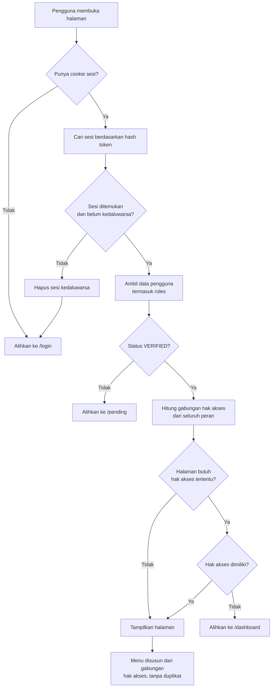
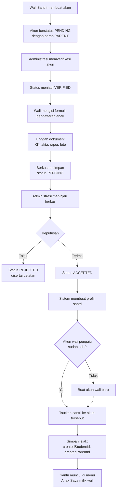
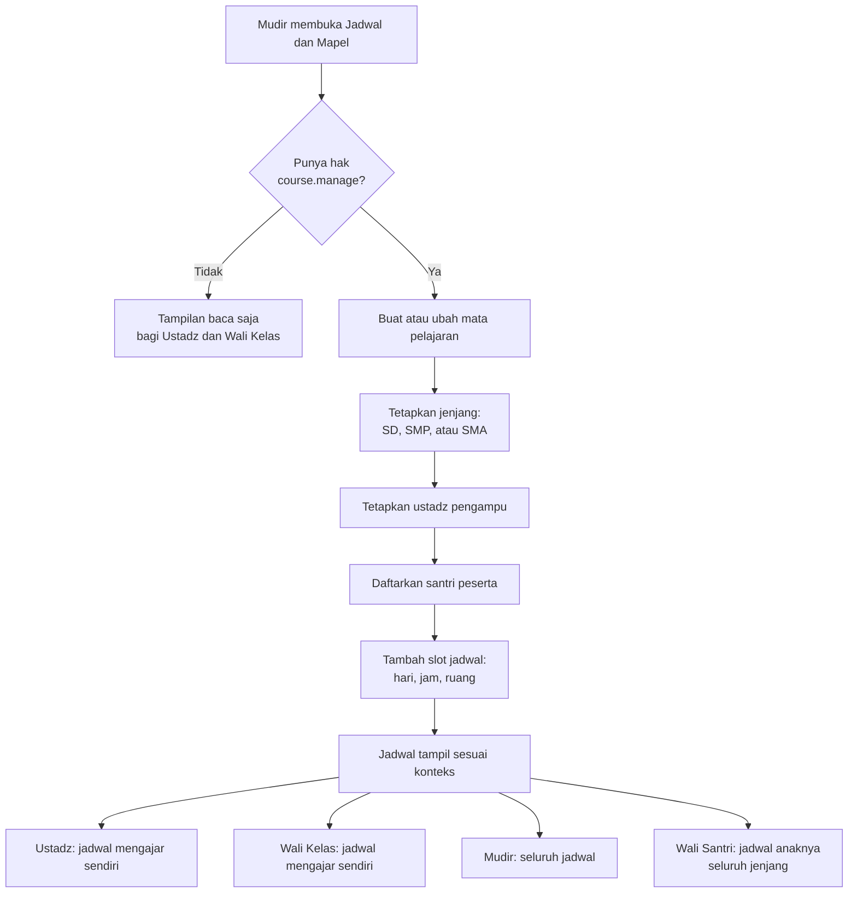
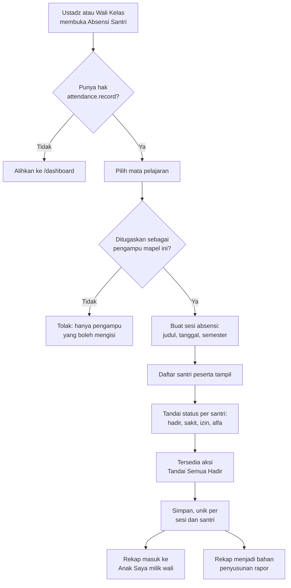
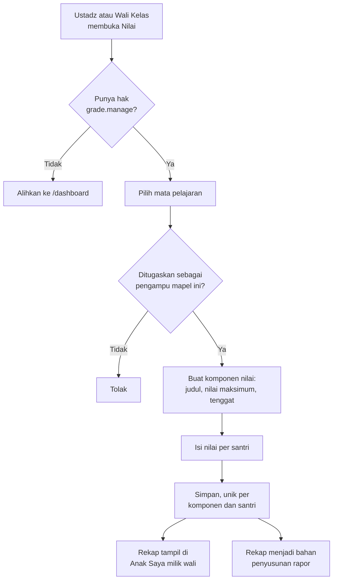
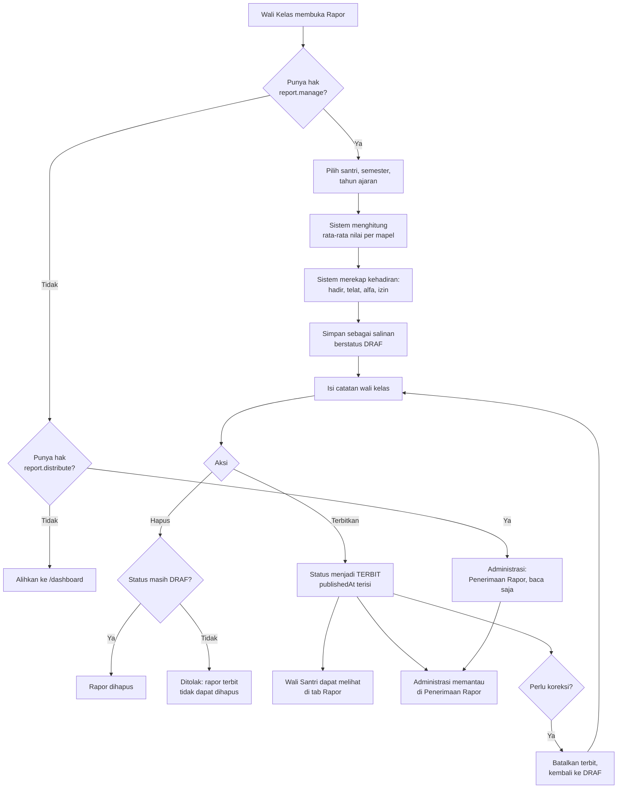
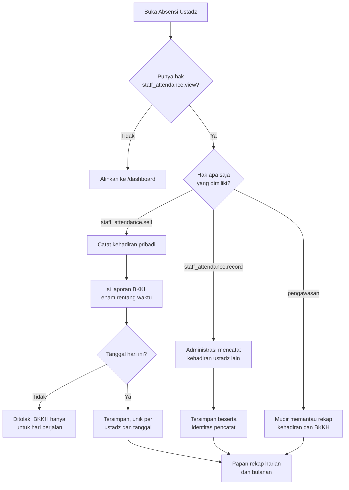
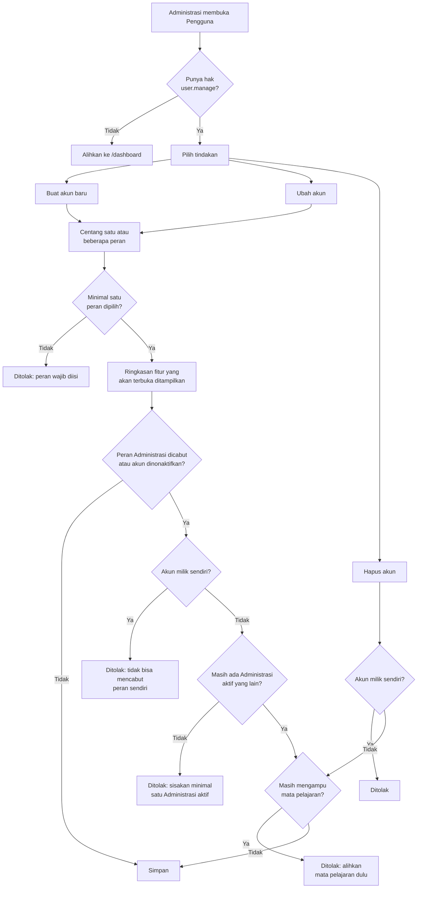
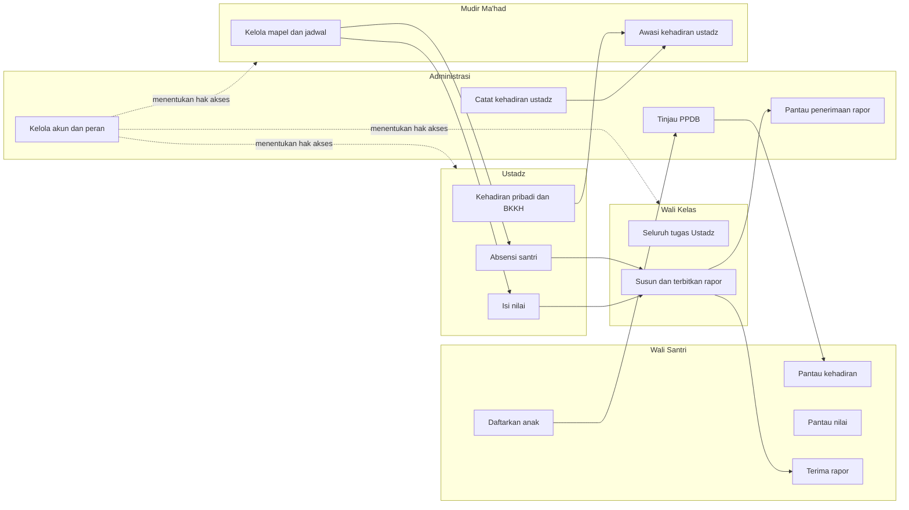

# Flowchart Sistem — Pesantren Digital

Dokumen ini memuat alur proses aplikasi setelah penerapan kontrol akses berbasis
peran. Setiap alur ditulis dengan Mermaid sehingga dapat langsung dibaca di
GitHub maupun disalin ke naskah.

---

## 1. Autentikasi dan Otorisasi

Alur ini berlaku untuk **setiap** permintaan halaman di dalam aplikasi. Pengecekan
hak akses dilakukan berdasarkan gabungan peran, bukan satu peran tunggal.

**Inti perubahan:** satu pengguna dapat memegang beberapa peran. Hak aksesnya
adalah gabungan (union) dari hak akses seluruh peran tersebut, dan menu yang
tampil merupakan gabungan menu yang sudah dihilangkan duplikatnya.

---

## 2. Pendaftaran Santri Baru (PPDB)

---

## 3. Penjadwalan dan Mata Pelajaran

Kewenangan ini dipegang **Mudir Ma'had**, bukan Administrasi.

---

## 4. Absensi Santri

Catatan: hak akses `attendance.record` memberi **kemampuan**, sedangkan
penugasan pengampu menentukan **mata pelajaran mana** yang boleh diisi. Keduanya
diperiksa berurutan.

---

## 5. Pengelolaan Nilai

---

## 6. Pengelolaan Rapor

Alur ini melibatkan tiga peran dengan kewenangan berbeda: Wali Kelas menyusun,
Administrasi memantau penyerahan, Wali Santri menerima.

**Alasan rapor disimpan sebagai salinan:** nilai akhir dan rekap kehadiran
di-*snapshot* saat rapor dibuat. Jika nilai sumber diedit setelah rapor terbit,
isi rapor tidak berubah, sehingga dokumen yang sudah diterima wali santri tetap
konsisten.

---

## 7. Absensi Ustadz dan BKKH

Pengguna yang memegang dua peran sekaligus, misalnya Administrasi merangkap
Ustadz, melihat **keduanya**: formulir kehadiran pribadi sekaligus papan
pengawasan seluruh ustadz.

---

## 8. Manajemen Pengguna dan Peran

**Alasan pagar pengaman:** tidak ada peran super admin terpisah. Karena hak
`user.manage` hanya dimiliki Administrasi, hilangnya seluruh akun Administrasi
aktif membuat pengelolaan pengguna tidak dapat dipulihkan dari dalam aplikasi.
Dua pemeriksaan di atas mencegah kondisi tersebut.

---

## 9. Alur Menyeluruh per Peran

Satu akun dapat berada di lebih dari satu kotak peran di atas. Dalam kondisi
tersebut, akun memperoleh gabungan seluruh alur yang dimiliki peran-perannya.
